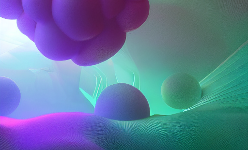

*Neural inverse rendering according to Stable Diffusion v1-5*

Welcome to the **3D Deep Learning Reading Group**. We are an online community that meets weekly to discuss the latest developments in 3D Deep Learning and their applications in the virtual and physical world. We are particularly interested in **Neural Fields, Implicit Representations, 3D Reconstruction and Generation, 3D in Robotics**, among other topics. Please check these curated lists of papers that we use as reference material: [Awesome-Implicit-NeRF-Robotics](https://github.com/zubair-irshad/Awesome-Implicit-NeRF-Robotics) and [Awesome Implicit Neural Representations](https://github.com/vsitzmann/awesome-implicit-representations). Join us to stay current on this exciting field!

Feel free to view and contribute on [Github](https://github.com/3D-DeepLearning-RG/3D-DeepLearning-RG.github.io).

Additional information will be provided soon.

## # Sessions

When | Presenter| What       | Authors  | Notes
-----|----------|------------|----------|--------
 TBD | Mauro Comi| [Neural Fields in Visual Computing and Beyond](https://arxiv.org/abs/2111.11426) | 

## # Resources
- [This repository on Github](https://github.com/3D-DeepLearning-RG/3D-DeepLearning-RG.github.io)
- [Awesome-Implicit-NeRF-Robotics](https://github.com/zubair-irshad/Awesome-Implicit-NeRF-Robotics): list of Implicit Representations and NeRF papers relevant to the physical world.
- [Awesome Implicit Neural Representations](https://github.com/vsitzmann/awesome-implicit-representations): list of Implicit Representations and NeRF papers curated by Vincent Sitzmann, Assistant Professor at MIT.