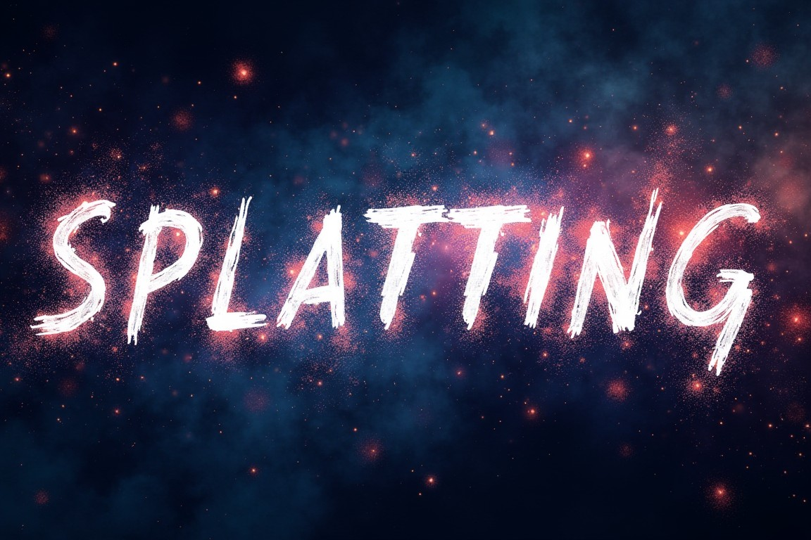

*Gaussain Splatting according to Flux 1.1 PRO*

Gaussian splatting Reading Group @ MBZUAI

Time: 6:00-7:00pm Thursdays, Abu DHabi time (GMT+04)  

 
## # Join us

<!-- 
- [Join here](https://join.slack.com/t/neuralfields/shared_invite/zt-2g0gtol8l-PgiDnHmCpWVidYzXypO7_Q), or [please let me know](contact) if the link is expired.
- The channel we use is the **#reading_group** channel. If you haven't added it already, please go to **Add channels** or **Browse channels** from the Slack workspace to find it. 
- [Add the Google Calendar](https://calendar.google.com/calendar/u/0?cid=NTk4MGNmN2IyOTA0NWU1ODViOGEwOTY0YWY3MjE1MDI2YjA0OTM5ZWUzMWNkODYzOWM3NmVmMzA3MDc4YTQ3Y0Bncm91cC5jYWxlbmRhci5nb29nbGUuY29t) to stay up-to-date with the sessions. -->

Don't hesitate to reach out if you have any questions or need more information.

 
## # Sessions

When | Presenter| What       | Notes
-----|----------|------------|--------
17/04/2024 | Mauro Comi | Physics and 3D Gaussian Splatting | [PhysGaussian](https://xpandora.github.io/PhysGaussian/), [Spring-Mass 3DGS](https://zlicheng.com/spring_gaus/) |
29/04/2024 | Mauro Comi | LLMs and 3D Gaussian Splatting | Feature 3DGS, Gaussian Grouping |

## Resources

- Original repo used as a learning resource: [https://github.com/OutofAi/2D-Gaussian-Splatting](https://github.com/OutofAi/2D-Gaussian-Splatting)
- An implementation with added explanation, using a more low-level framework instead of Torch: [https://github.com/Sebo-the-tramp/tinysplat](https://github.com/Sebo-the-tramp/tinysplat)
- First draft of explaining Gaussian to a broader audience (not production ready): [https://sebo-the-tramp.github.io/p/tiny-splat/](https://sebo-the-tramp.github.io/p/tiny-splat/)
- One of the best open-source implementations of Gaussian splatting: [https://github.com/nerfstudio-project/gsplat](https://github.com/nerfstudio-project/gsplat)
- A very technical and insightful paper from the same team: [https://arxiv.org/pdf/2409.06765](https://arxiv.org/pdf/2409.06765)
